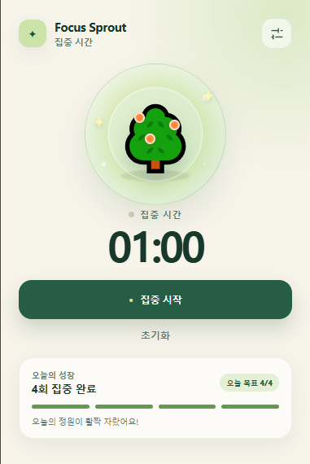

# Focus Sprout

집중 세션을 완료할수록 작은 식물이 자라는 Chrome용 포모도로 타이머입니다. popup을 닫아도 종료 시각과 진행 기록을 유지하고, 하루 목표를 달성하면 완성된 나무를 보여줍니다.



## 담당 범위

개인 프로젝트로 제품 기획부터 확장 프로그램 구조, 타이머 상태 관리, UI와 빌드 설정까지 직접 구현했습니다.

- WXT·React·TypeScript 기반 Chrome Manifest V3 확장 프로그램 구성
- 집중·휴식 타이머와 시작, 일시정지, 재개, 초기화 동작 구현
- `browser.storage.local`에 설정과 날짜별 완료 기록 저장
- `browser.alarms`를 이용해 popup이 닫힌 동안에도 종료 시점 처리
- 설정·초기화 창을 layered panel로 분리하고 Controller에서 화면 상태 조정

## 해결한 문제

Chrome 확장 프로그램의 popup은 사용자가 창을 닫을 때 함께 종료됩니다. 따라서 화면의 `setInterval`만으로 시간을 관리하면 다시 열었을 때 진행 상태가 사라지거나 시간이 어긋날 수 있습니다.

Focus Sprout는 남은 초를 계속 감소시키는 대신 절대 종료 시각인 `EndsAt`을 저장합니다. popup을 다시 열면 현재 시각과 `EndsAt`의 차이로 표시 시간을 복원하고, background의 alarm이 종료 전환과 일일 기록 갱신을 담당합니다.

```text
Popup Action
  → FocusBasePanelController
  → FocusTimer Action
  → FocusTimerManager
  → browser.storage.local + browser.alarms
  → storage 변경 알림
  → 열려 있는 Popup UI 동기화
```

## 주요 기능

- 집중 시간과 휴식 시간 타이머
- 시작, 일시정지, 재개, 초기화
- popup을 닫았다가 열어도 유지되는 타이머 상태
- 날짜별 집중 완료 횟수와 하루 목표 진행률
- 완료 횟수에 따라 자라는 식물과 목표 달성 나무
- 집중·휴식 시간을 1~60분 범위로 설정
- 별도 서버 전송 없이 현재 Chrome 프로필에만 데이터 저장

## 핵심 코드

- [FocusTimerManager](./src/managers/focus_timer/FocusTimerManager.ts) — 상태 정규화, 저장, alarm 예약과 완료 전환
- [Background entrypoint](./src/entrypoints/background.ts) — Chrome alarm 수신과 저장 상태 복구
- [FocusBasePanelController](./src/panels/base/FocusBasePanel/controller/FocusBasePanelController.ts) — 화면 상태, 사용자 동작과 storage 구독 조정
- [Timer Actions](./src/panels/base/FocusBasePanel/controller/actions) — 시작·일시정지·초기화·설정 저장 유스케이스
- [PanelLayerHost](./src/app/panel_layer/PanelLayerHost.tsx) — 설정과 초기화 확인 패널의 표시 순서 관리
- [WXT 설정](./wxt.config.ts) — Manifest V3와 `storage`, `alarms` 권한 선언

## 기술 구성

- WXT
- React 19
- TypeScript
- Chrome Manifest V3
- Chrome Extension Storage·Alarms API

## 설치 및 실행

### 1. 저장소 준비

```bash
git clone https://github.com/hb2133/focus-sprout.git
cd focus-sprout
npm install
```

### 2. 확장 프로그램 빌드

```bash
npm run build
```

빌드가 완료되면 `.output/chrome-mv3` 디렉터리가 생성됩니다.

### 3. Chrome에 불러오기

1. 주소창에서 `chrome://extensions`를 엽니다.
2. 오른쪽 위의 `개발자 모드`를 켭니다.
3. `압축해제된 확장 프로그램을 로드`를 누릅니다.
4. 프로젝트의 `.output/chrome-mv3` 디렉터리를 선택합니다.
5. 도구 모음에서 Focus Sprout 아이콘을 눌러 실행합니다.

개발 중에는 `npm run dev`를 실행한 뒤 Chrome 확장 프로그램 관리 화면에서 새로고침해 변경 사항을 확인합니다.

## 검증

```bash
npm run lint
npm run compile
npm run build
```

| 명령어 | 확인 항목 |
| --- | --- |
| `npm run lint` | 코드 규칙과 잘못된 패턴 |
| `npm run compile` | TypeScript 타입 오류 |
| `npm run build` | Chrome Manifest V3 배포 산출물 생성 |

## 권한과 데이터

- `storage`: 타이머 설정, 현재 상태와 날짜별 집중 기록을 저장합니다.
- `alarms`: popup이 닫혀 있어도 타이머 종료 시점을 처리합니다.

데이터는 외부 서버로 전송하지 않으며 현재 Chrome 프로필의 `browser.storage.local`에만 저장됩니다.
